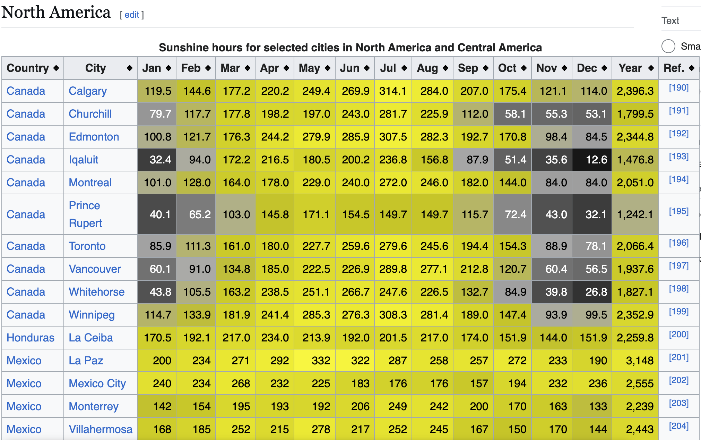

Say we're down about the lack of sunshine in our city and we really want to know what the sunniest cities in the world are. The data we're looking at is the Wikipedia article titled [List of cities by sunshine duration](https://en.wikipedia.org/wiki/List_of_cities_by_sunshine_duration). 



The general process we follow is 1.) extract the data, 2.) apply various transformations until it's in the format we want it to be in, then 3.) load into whatever application we want for convenient viewing. As you can imagine, there are many ways to carry out this process, but we're piping together command line utilities here.

The first step to extracting the text we need is the `curl` command.

```
$ curl https://en.wikipedia.org/wiki/List_of_cities_by_sunshine_duration
```

HTML parsing can be very challenging, so to help narrow down the text we're most interested in we use the [pup](https://github.com/ericchiang/pup) utility. Referencing the documentation for this tool we can use the various selectors available to us and grab the text out of the table. The last column in the table is a footnote that we want to leave out.

```
$ pup '.wikitable:first-of-type td:not(:nth-of-type(16)) text{}'
``` 

We now have the text we want, but it's not quite there yet, pup leaves lots of blank lines in, so to strip those out we use:

```
$ grep -v '^$'
```

Next we use [awk](https://www.gnu.org/software/gawk/manual/gawk.html) is an incredibly useful command line tool that is frequently used in Linux systems to pull information out of semi-structured text.  `awk` is well suited to joining each group of 15 lines with commas and a new line at the end to bring back the table cells together to form a CSV.

putting it all together you get:

first try:
```
curl https://en.wikipedia.org/wiki/List_of_cities_by_sunshine_duration |
pup '.wikitable:first-of-type td:not(:nth-of-type(16)) text{}' | 
grep -v '^$' |
awk '{printf "%s%s", (NR%15 == 1 ? "" : ", "), $0} NR % 15 == 0 {print ""}'
```

second try:
```
curl https://en.wikipedia.org/wiki/List_of_cities_by_sunshine_duration |
pup '.wikitable:nth-of-type(4) tr > :not(:last-child) text{}' |
grep -v '^$' |
awk '{printf "%s%s", (NR%15 == 1 ? "" : ", "), $0} NR % 15 == 0 {print ""}'
```

one row of weird data in North America is messing this up: "Saint Pierre and Miquelon Saint-Pierre" so we need a little refinement to our awk script. Luckily, LLMs are well versed in awk. Here's the final version of the awk script:



final commands here:
```
curl https://en.wikipedia.org/wiki/List_of_cities_by_sunshine_duration |
pup '.wikitable:nth-of-type(4) tr > :not(:last-child) text{}' |
grep -v '^$' |
awk -f script.awk > test.csv
```

Wow! that turned into more work than I expected. Surely there's an easier way to do this! Next time.
